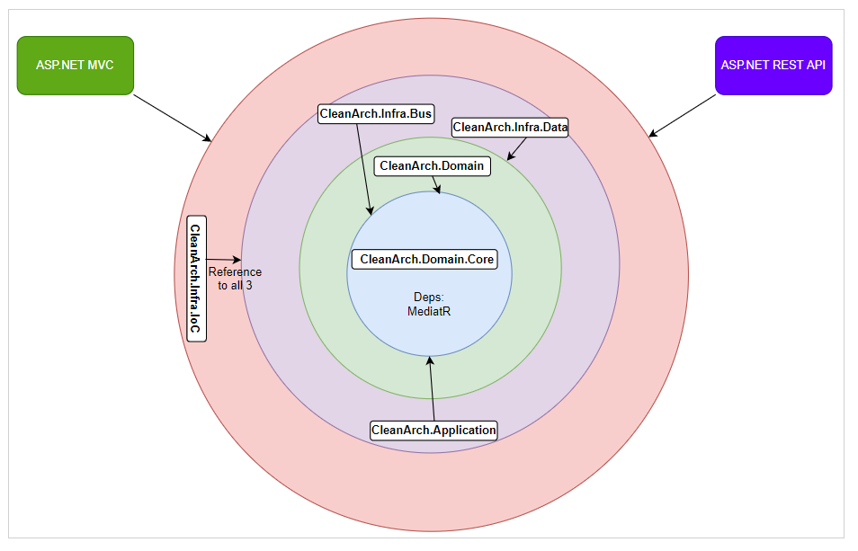

- [Deps diagram](#deps-diagram)
- [CleanArch.Mvc](#cleanarchmvc)
- [CleanArch.Domain](#cleanarchdomain)
- [CleanArch.Domain.Core](#cleanarchdomaincore)
- [CleanArch.Infra.Data](#cleanarchinfradata)
- [CleanArch.Application](#cleanarchapplication)
- [CleanArch.Infra.IoC](#cleanarchinfraioc)
- [CleanArch.Infra.Bus](#cleanarchinfrabus)
- [Links](#links)

# Deps diagram



# CleanArch.Mvc


* Add migration
```
add-migration "InitialMigration" -Context ApplicationDbContext
```

* Update database

In PMC console run: 
```
update-database
```

>NOTE: it might be necessary to run it with parameter like this `update-database -Context ApplicationDbContext`

* Register a new user

kicaj@wp.pl
Password1234!

* In table `dbo.AspNetUsers` update column `EmailConfirmed`

Set value True (this implementation does not support sending an email).

* Login to the system

# CleanArch.Domain

It might be necessary to run in PMC command `dotnet restore` after project creation to compile it. More here: https://stackoverflow.com/questions/48440223/assets-file-project-assets-json-not-found-run-a-nuget-package-restore


# CleanArch.Domain.Core

Contains interfaces and some basic types for message bus.

# CleanArch.Infra.Data

It might be necessary to run in PMC command `dotnet restore` after project creation to compile it. More here: https://stackoverflow.com/questions/48440223/assets-file-project-assets-json-not-found-run-a-nuget-package-restore

* Add migration

Make sure that in PMC is selected default project `CleanArch.Infra.Data`.

```
add-migration "InitialMigration" -Context UniversityDbContext
```

* Update database

In PMC console run:

```
update-database -Context UniversityDBContext
```

# CleanArch.Application

For now no comments.
# CleanArch.Infra.IoC

For now no comments.

# CleanArch.Infra.Bus

It uses nuget **[MediatR](https://github.com/jbogard/MediatR)**.

# Links
Based on https://hyland.udemy.com/course/getting-started-with-net-core-clean-architecture/learn/lecture/14541160#overview   
https://github.com/innovativeinstitution/CleanArchDemo
