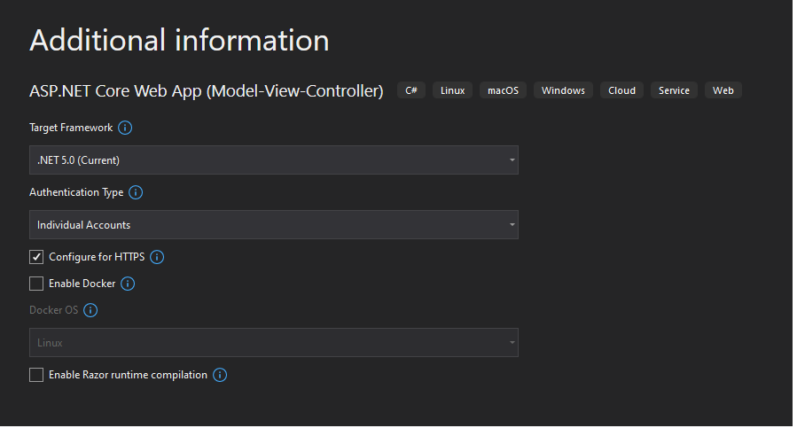

# CleanArch.Mvc


* Add migration
```
add-migration "InitialMigration" -Context ApplicationDbContext
```

* Update database
```
update-database
```

* Register a new user

kicaj@wp.pl
Password1234!

* In table `dbo.AspNetUsers` update column `EmailConfirmed`

Set value True (this implementation does not support sending an email).

* Login to the system

# CleanArch.Domain

It might be necessary to run in PMC command `dotnet restore`. More here: https://stackoverflow.com/questions/48440223/assets-file-project-assets-json-not-found-run-a-nuget-package-restore
# Links
https://hyland.udemy.com/course/getting-started-with-net-core-clean-architecture/learn/lecture/14541160#overview
